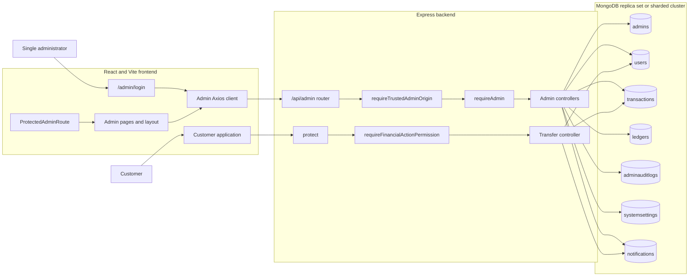
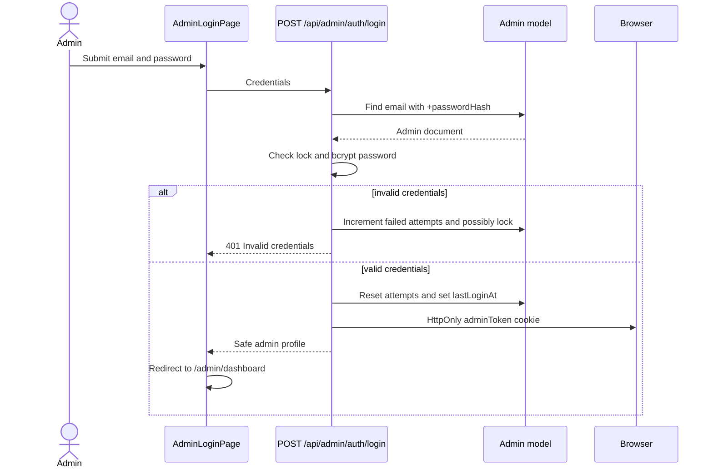
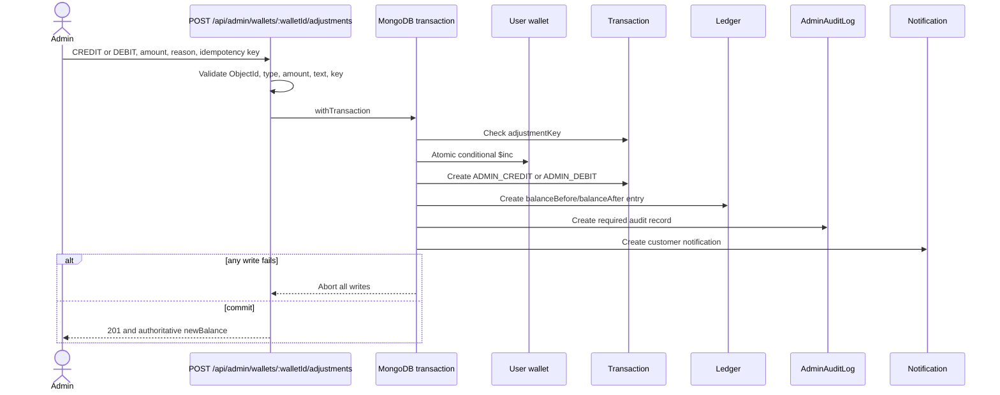

# Bankly Single-Admin Portal

## 1. Feature overview

Bankly includes a separate administrative portal for customer oversight, wallet inspection, transaction review, reporting, settings, and controlled balance adjustments.

The portal has the following identity rules:

- There is exactly **one admin account**.
- There is **no public admin sign-up or registration endpoint**.
- The admin is created through the environment-driven secure seed at [`backend/src/scripts/seedAdmin.js`](../backend/src/scripts/seedAdmin.js).
- Frozen-account restrictions are enforced by the backend, not by frontend controls.
- Administrative balance changes use MongoDB transactions and corresponding transaction and ledger entries.
- Audit logs are read-only through the admin API.
- Customer authentication and admin authentication use separate cookies and signing secrets.
- Frontend route protection improves navigation and user experience, but backend `requireAdmin` middleware is the authorization boundary.

Core capabilities:

- Admin login, logout, profile retrieval, password change, lockout, and session invalidation.
- Dashboard and aggregated reports.
- Paginated customer, wallet, transaction, frozen-account, and audit-log views.
- Customer freeze, unfreeze, and session revocation.
- Transactional wallet credit and debit adjustments.
- Read-only audit-log access.
- Validated singleton system settings.

Primary implementation locations:

- Backend route registration: [`backend/src/routes/admin.route.js`](../backend/src/routes/admin.route.js)
- Backend application mount: [`backend/src/index.js`](../backend/src/index.js)
- Admin authentication middleware: [`backend/src/middleware/adminAuth.middleware.js`](../backend/src/middleware/adminAuth.middleware.js)
- Admin CSRF middleware: [`backend/src/middleware/adminCsrf.middleware.js`](../backend/src/middleware/adminCsrf.middleware.js)
- Frontend route registration: [`frontend/src/App.jsx`](../frontend/src/App.jsx)
- Admin API client: [`frontend/src/admin/services/adminApi.js`](../frontend/src/admin/services/adminApi.js)
- Admin authentication provider: [`frontend/src/admin/auth/AdminAuthProvider.jsx`](../frontend/src/admin/auth/AdminAuthProvider.jsx)

## 2. Architecture



Vite proxies `/api` to `http://localhost:5001` in [`frontend/vite.config.js`](../frontend/vite.config.js).

## 3. Database models

The project uses Mongoose and MongoDB. It does not use Prisma.

| Model | File | Purpose and important fields |
| --- | --- | --- |
| `Admin` | [`backend/src/models/admin.model.js`](../backend/src/models/admin.model.js) | Single administrator. Stores `name`, unique `email`, non-selected `passwordHash`, `status`, lockout fields, `lastLoginAt`, and `tokenVersion`. Passwords use bcrypt with 12 rounds. |
| `User` | [`backend/src/models/user.model.js`](../backend/src/models/user.model.js) | Customer and wallet record. Stores identity fields, non-selected password hash, account number, QR code, numeric balance, `accountStatus`, freeze metadata, and `sessionVersion`. |
| `Transaction` | [`backend/src/models/transaction.model.js`](../backend/src/models/transaction.model.js) | Transfers and admin adjustments. Types are `TRANSFER`, `ADMIN_CREDIT`, and `ADMIN_DEBIT`. `adjustmentKey` is hidden and uniquely indexed for idempotency. |
| `Ledger` | [`backend/src/models/ledger.model.js`](../backend/src/models/ledger.model.js) | Balance history for admin adjustments. Stores the transaction, user, credit/debit type, amount, balances before and after, note, and performing admin. |
| `AdminAuditLog` | [`backend/src/models/adminAuditLog.model.js`](../backend/src/models/adminAuditLog.model.js) | Append-only administrative history with action, entity, before/after snapshots, reason, IP address, user agent, and timestamp. |
| `SystemSettings` | [`backend/src/models/systemSettings.model.js`](../backend/src/models/systemSettings.model.js) | Singleton configuration for application name, THB currency, transfer limits, fees, maintenance mode, and last updating admin. |
| `Notification` | [`backend/src/models/notification.model.js`](../backend/src/models/notification.model.js) | Customer notifications created by freezes, unfreezes, transfers, and balance adjustments. |

Common admin query indexes are declared alongside the schemas. The adjustment idempotency constraint is:

```js
transactionSchema.index(
  { adjustmentKey: 1 },
  { unique: true, sparse: true }
);
```

The application validates transaction support in [`backend/src/lib/db.js`](../backend/src/lib/db.js) using MongoDB's `hello` command. The database must be a replica set or sharded cluster.

## 4. Admin authentication flow

Implementation:

- Controller: [`backend/src/controllers/adminAuth.controller.js`](../backend/src/controllers/adminAuth.controller.js)
- Token handling: [`backend/src/lib/adminToken.js`](../backend/src/lib/adminToken.js)
- Middleware: [`backend/src/middleware/adminAuth.middleware.js`](../backend/src/middleware/adminAuth.middleware.js)
- Model: [`backend/src/models/admin.model.js`](../backend/src/models/admin.model.js)
- Frontend provider: [`frontend/src/admin/auth/AdminAuthProvider.jsx`](../frontend/src/admin/auth/AdminAuthProvider.jsx)
- Frontend guard: [`frontend/src/admin/components/ProtectedAdminRoute.jsx`](../frontend/src/admin/components/ProtectedAdminRoute.jsx)



The admin token:

- Uses `ADMIN_JWT_SECRET`.
- Is signed with `HS256`.
- Has audience `admin-portal`.
- Contains `role: "admin"` and the admin `tokenVersion`.
- Is stored in the `adminToken` cookie.
- Expires after eight hours.
- Uses `HttpOnly`, `SameSite=Strict`, and `Secure` in production.

`requireAdmin` checks the cookie, signature, expiry, audience, role, database record, account lock, and token version. A password change increments `tokenVersion`, invalidating all previously issued admin tokens.

Five failed login attempts lock the account for 30 minutes. Authentication failures return a generic message to avoid email enumeration.

## 5. Freeze and unfreeze flow

Implementation:

- Routes: [`backend/src/routes/admin.route.js`](../backend/src/routes/admin.route.js)
- Controller: [`backend/src/controllers/adminUser.controller.js`](../backend/src/controllers/adminUser.controller.js)
- Central financial guard: [`backend/src/lib/financialActionGuard.js`](../backend/src/lib/financialActionGuard.js)
- Customer transfer route: [`backend/src/routes/transfer.route.js`](../backend/src/routes/transfer.route.js)

Freeze:

1. The admin calls `PATCH /api/admin/users/:userId/freeze` with a required reason.
2. `requireAdmin` authorizes the admin.
3. The controller validates the ObjectId, reason, current status, and reason length.
4. A Mongoose transaction changes `accountStatus` to `FROZEN`, records freeze metadata, increments `sessionVersion`, creates a notification, and creates a `USER_FROZEN` audit entry.
5. An audit-write failure aborts the transaction.
6. Existing customer sessions are invalid because `sessionVersion` changed.
7. Every financial request performs a fresh user lookup through `requireFinancialActionPermission`.
8. A frozen customer receives the business error `ACCOUNT_FROZEN`.

Unfreeze:

1. The admin calls `PATCH /api/admin/users/:userId/unfreeze` with a required reason.
2. The controller requires the current state to be `FROZEN`.
3. A transaction restores `accountStatus` to `ACTIVE`, records `unfrozenAt`, creates a notification, and writes a `USER_UNFROZEN` audit entry.
4. The original freeze reason and timestamp are retained as history.

Frozen-account restrictions are enforced by the backend. Disabled frontend buttons are not a security control. Frozen users may continue to authenticate and access read-only account, balance, and transaction endpoints, but financial actions are rejected.

## 6. Balance-adjustment flow

Implementation:

- Controller and service: [`backend/src/controllers/adminAdjustment.controller.js`](../backend/src/controllers/adminAdjustment.controller.js)
- Models:
  - [`backend/src/models/user.model.js`](../backend/src/models/user.model.js)
  - [`backend/src/models/transaction.model.js`](../backend/src/models/transaction.model.js)
  - [`backend/src/models/ledger.model.js`](../backend/src/models/ledger.model.js)
  - [`backend/src/models/adminAuditLog.model.js`](../backend/src/models/adminAuditLog.model.js)



Rules:

- `walletId` must be a valid ObjectId.
- `amount` must be a positive JavaScript number with no more than two decimal places.
- A debit uses `balance: { $gte: amount }` in the atomic update and cannot make the balance negative.
- The source of truth is the persisted conditional update, not frontend or in-memory state.
- Every balance adjustment creates a transaction and a ledger entry.
- Every query and write participating in the adjustment receives the Mongoose session.
- Audit failure aborts the financial transaction.
- The session is always ended in `finally`.
- Duplicate requests are rejected by a hashed admin-scoped idempotency key and the unique `adjustmentKey` index.

## 7. Audit-log flow

Implementation:

- Writer and sanitizer: [`backend/src/lib/audit.js`](../backend/src/lib/audit.js)
- Model: [`backend/src/models/adminAuditLog.model.js`](../backend/src/models/adminAuditLog.model.js)
- Read controller: [`backend/src/controllers/adminAuditLog.controller.js`](../backend/src/controllers/adminAuditLog.controller.js)

Sensitive administrative actions call `createAuditLog`. The writer:

1. Accepts the acting admin only from authenticated backend context.
2. Recursively redacts passwords, tokens, secrets, card data, PINs, and selected identity secrets from snapshots.
3. Captures the action, entity, previous and new values, reason, IP address, user agent, and timestamp.
4. Joins the surrounding Mongoose transaction when a session is provided.
5. Throws for operations using `throwOnError: true`, so required auditing and the business mutation succeed or fail together.

Supported action constants include:

- `ADMIN_LOGIN_SUCCESS`
- `ADMIN_LOGIN_FAILED`
- `ADMIN_LOGOUT`
- `ADMIN_PASSWORD_CHANGED`
- `USER_FROZEN`
- `USER_UNFROZEN`
- `USER_SESSIONS_REVOKED`
- `BALANCE_CREDIT_ADJUSTMENT`
- `BALANCE_DEBIT_ADJUSTMENT`
- `SYSTEM_SETTINGS_UPDATED`

Audit logs are read-only. The backend exposes only `GET /api/admin/audit-logs`; there are no create, update, or delete admin-audit routes.

## 8. Admin API endpoints

All paths below are mounted under `/api/admin`. Except for login, they require `requireAdmin`. The entire router uses `requireTrustedAdminOrigin`.

| Method | Endpoint | Authentication | Purpose |
| --- | --- | --- | --- |
| `POST` | `/auth/login` | Public admin entry point | Authenticate the single seeded admin. This is not registration. |
| `POST` | `/auth/logout` | Admin | Clear the admin cookie and write a logout audit entry. |
| `GET` | `/auth/me` | Admin | Return the safe current admin profile. |
| `POST` | `/auth/change-password` | Admin | Verify the current password, change it transactionally, audit it, and invalidate admin sessions. |
| `GET` | `/audit-logs` | Admin | Read paginated audit records with action, entity, entity ID, and date filters. |
| `GET` | `/reports/dashboard` | Admin | Dashboard totals, recent records, and trend data. |
| `GET` | `/reports/transactions` | Admin | Transaction summary, status/type breakdowns, and trend data. |
| `GET` | `/reports/users` | Admin | User summary, status breakdown, registrations, and wallet totals. |
| `GET` | `/reports/frozen-accounts` | Admin | Paginated frozen accounts and aggregate balance data. |
| `GET` | `/reports/wallet-balances` | Admin | Wallet totals, status breakdown, distribution, and top wallets. |
| `GET` | `/settings` | Admin | Retrieve or create the singleton settings document. |
| `PATCH` | `/settings` | Admin | Validate, update, and audit system settings transactionally. |
| `GET` | `/wallets` | Admin | Paginated wallets with search, status, balance, sort, and page filters. |
| `GET` | `/wallets/:walletId` | Admin | Wallet owner, available balance, totals, ledger entries, and recent transactions. |
| `POST` | `/wallets/:walletId/adjustments` | Admin | Create an idempotent credit or debit adjustment. |
| `GET` | `/transactions` | Admin | Paginated transaction list with identifiers, parties, type, status, dates, amounts, and sorting. |
| `GET` | `/transactions/:transactionId` | Admin | Transaction details and related ledger entries. |
| `GET` | `/users` | Admin | Paginated customer list with search, status, registration dates, and sorting. |
| `GET` | `/users/:userId` | Admin | Safe customer details and recent transactions. |
| `PATCH` | `/users/:userId/freeze` | Admin | Freeze a customer with a required reason. |
| `PATCH` | `/users/:userId/unfreeze` | Admin | Unfreeze a customer with a required reason. |
| `POST` | `/users/:userId/revoke-sessions` | Admin | Increment the customer session version and audit the action. |

## 9. Frontend routes

Routes are registered in [`frontend/src/App.jsx`](../frontend/src/App.jsx).

| Route | Component or behavior | Protected |
| --- | --- | --- |
| `/admin/login` | `AdminLoginPage` | No; authenticated admins are redirected |
| `/admin` | Redirect to `/admin/dashboard` | Yes |
| `/admin/dashboard` | `AdminDashboardPage` | Yes |
| `/admin/users` | `AdminUsersPage` | Yes |
| `/admin/users/frozen` | `AdminUsersPage` with `forcedStatus="FROZEN"` | Yes |
| `/admin/users/:userId` | `AdminUserDetailsPage` | Yes |
| `/admin/wallets` | `AdminWalletsPage` | Yes |
| `/admin/wallets/:walletId` | `AdminWalletDetailsPage` | Yes |
| `/admin/transactions` | `AdminTransactionsPage` | Yes |
| `/admin/transactions/:transactionId` | `AdminTransactionDetailsPage` | Yes |
| `/admin/balance-adjustments` | Redirect to `/admin/wallets` | Yes |
| `/admin/reports` | `AdminReportsPage` | Yes |
| `/admin/audit-logs` | `AdminAuditLogsPage` | Yes |
| `/admin/settings` | `AdminSettingsPage` | Yes |
| `/admin/profile` | `AdminProfilePage` | Yes |
| `/admin/*` | Admin page-not-found placeholder | Yes |

`AdminAuthProvider` checks `/api/admin/auth/me` using the admin cookie. `ProtectedAdminRoute` redirects unauthenticated requests to `/admin/login` and preserves the requested location. Customer authentication remains separate.

## 10. Environment variables

The template is [`backend/.env.example`](../backend/.env.example).

| Variable | Required | Purpose |
| --- | --- | --- |
| `PORT` | Yes | Express port; local configuration uses `5001`. |
| `NODE_ENV` | Yes | Use `development`, `test`, or `production`. Production enables secure cookies. |
| `MONGODB_URL` | Yes | MongoDB replica-set, Atlas, or sharded-cluster connection string. |
| `JWT_SECRET` | Yes | Customer JWT signing secret. |
| `ADMIN_JWT_SECRET` | Yes | Separate admin JWT signing secret. It must differ from `JWT_SECRET`. |
| `ADMIN_NAME` | Seed only | Name for the single seeded admin. |
| `ADMIN_EMAIL` | Seed only | Email for the single seeded admin. |
| `ADMIN_PASSWORD` | Seed only | Initial admin password; minimum eight characters. |
| `FRONTEND_URL` | Production recommended | Trusted frontend origin accepted by admin CSRF middleware. |
| `ADMIN_PORTAL_ORIGINS` | Optional | Comma-separated additional trusted admin origins. |
| `CLOUDINARY_CLOUD_NAME` | Customer feature dependent | Cloudinary cloud name. |
| `CLOUDINARY_API_KEY` | Customer feature dependent | Cloudinary API key. |
| `CLOUDINARY_API_SECRET` | Customer feature dependent | Cloudinary API secret. |
| `E2E_BASE_URL` | E2E optional | Overrides the default `http://127.0.0.1:5001` used by the admin E2E script. |

Do not commit `.env`. Use long, randomly generated, different values for the customer and admin JWT secrets.

## 11. Prisma migration instructions

There are no Prisma migration instructions for the current implementation because Bankly does not use Prisma:

- No `prisma` dependency is installed.
- No `schema.prisma` exists.
- No Prisma client is generated.
- Running `prisma generate` or `prisma migrate` is not a valid project step.

The actual persistence layer is Mongoose. Schema changes are made in `backend/src/models/*.model.js`.

For a Mongoose schema or index deployment:

1. Change the relevant Mongoose schema.
2. Add a one-time backfill under [`backend/src/scripts`](../backend/src/scripts) if existing documents need new values.
3. Test the backfill against a non-production database.
4. Take a production backup.
5. Deploy application code compatible with both old and new documents when possible.
6. Run the backfill once.
7. Verify indexes with MongoDB tooling and review query plans with `explain`.
8. Remove temporary compatibility logic only after all documents are migrated.

An existing backfill reference is [`backend/src/scripts/backfillModels.js`](../backend/src/scripts/backfillModels.js).

If the project is intentionally migrated to Prisma later, that is a separate architecture migration requiring a Prisma schema, data conversion plan, transaction review, generated client integration, and replacement of all Mongoose queries. Do not run Prisma commands against the current application.

## 12. Admin seed instructions

The admin is created only by [`backend/src/scripts/seedAdmin.js`](../backend/src/scripts/seedAdmin.js). There is no public admin sign-up.

Configure:

```dotenv
ADMIN_NAME=Admin
ADMIN_EMAIL=admin@example.com
ADMIN_PASSWORD=<strong-initial-password>
```

Then run:

```bash
cd backend
npm run seed:admin
```

The seed:

- Validates required environment variables.
- Validates email, name, and password length.
- Connects using `MONGODB_URL`.
- Refuses to create an admin if any admin already exists.
- Hashes the password through the `Admin` model hook.
- Never prints the password.
- Is safe to run repeatedly; subsequent runs make no changes.

For initial production provisioning, run the seed once from a trusted environment. Remove `ADMIN_PASSWORD` from the long-lived runtime environment after successful provisioning if operational procedures permit it.

## 13. Local development

Prerequisites:

- Node.js 20.19+ or 22.12+
- npm
- MongoDB Atlas or another replica-set/sharded MongoDB deployment

Backend:

```bash
cd backend
npm install
cp .env.example .env
# Fill in all required values.
npm run seed:admin
npm run dev
```

Frontend, in a second terminal:

```bash
cd frontend
npm install
npm run dev
```

Open:

```text
http://localhost:5173/admin/login
```

The backend listens on port `5001` by default, and the frontend development server proxies `/api` requests to it.

Validation commands currently supported:

```bash
cd backend
npm test
npm run test:unit
npm run test:integration
npm run test:e2e:admin

cd ../frontend
npx eslint src/admin src/App.jsx
npm run build
```

The E2E command requires the backend to be running and access to the configured MongoDB database. It creates or reuses customers named `E2E Sender` and `E2E Receiver`, then leaves transaction, ledger, and audit records as evidence.

## 14. Production deployment notes

Backend:

- Set `NODE_ENV=production`.
- Run the service with `node src/index.js` or an equivalent supervised process.
- Configure TLS at the load balancer or reverse proxy.
- Set `FRONTEND_URL` and, if needed, `ADMIN_PORTAL_ORIGINS`.
- Restrict CORS to deployed frontend origins; the current static localhost CORS list in [`backend/src/index.js`](../backend/src/index.js) must be configured for the production domain.
- Use a MongoDB replica set or sharded cluster.
- Keep `JWT_SECRET` and `ADMIN_JWT_SECRET` different and managed by a secret store.
- Run the single-admin seed exactly once.
- Back up MongoDB before schema backfills or index changes.
- Monitor failed admin logins, locked accounts, audit-write failures, transaction aborts, and duplicate adjustment responses.
- Do not run multiple uncoordinated seed jobs.

Frontend:

```bash
cd frontend
npm ci
npm run build
```

Deploy the generated `frontend/dist` directory as a single-page application. Configure the host to serve `index.html` for client-side routes such as `/admin/dashboard`.

Cookies require HTTPS in production. Ensure reverse-proxy settings preserve the correct origin and client IP information used by CSRF checks and audit logs.

## 15. Security considerations

- Only one seeded admin is supported.
- No public admin registration route exists.
- Admin and customer JWTs use different secrets and cookies.
- Admin JWT verification pins `HS256`, audience, role, expiry, and token version.
- Admin cookies are HTTP-only and strict same-site; they are secure in production.
- State-changing browser requests are checked by `requireTrustedAdminOrigin`.
- Normal customer tokens cannot authorize admin endpoints.
- Backend `requireAdmin` middleware protects every admin endpoint except login.
- Admin account lockout applies after five failed attempts.
- Login errors do not disclose whether an admin email exists.
- Password hashes, tokens, session versions, idempotency keys, and unnecessary customer fields are excluded from API projections.
- Password changes invalidate other admin sessions.
- Customer session revocation and freezing invalidate existing customer tokens through `sessionVersion`.
- Frozen-account financial restrictions are enforced by backend middleware and service checks.
- Balance debits use atomic conditional updates to prevent negative balances and lost updates.
- Admin balance adjustments use MongoDB transactions, transaction records, ledger entries, audit entries, and idempotency keys.
- Required audit writes fail closed for sensitive mutations.
- Audit snapshots recursively redact credential and payment-secret keys.
- Audit logs are read-only through the application API.
- User-supplied regular-expression searches are escaped.
- ObjectIds, dates, enum filters, pagination, sorting fields, money inputs, settings, and action reasons are validated.

## 16. Known limitations

- Money is stored as MongoDB/JavaScript `Number`, not integer satang or `Decimal128`. Binary floating-point representations may appear internally. A money-storage migration is required to eliminate that behavior.
- Normal peer-to-peer transfers create `Transaction` and notification records but do not currently create `Ledger` records. Ledger creation is implemented for admin balance adjustments.
- `maintenanceMode`, fees, and configured transfer limits are persisted and administered, but the customer transfer controller does not currently enforce all system-setting values.
- The backend has no TypeScript configuration, build script, or lint script.
- The frontend is JavaScript and has no type-check script.
- Prisma is not part of the project.
- The full customer frontend currently has unrelated lint errors and hook warnings; the admin frontend lint target passes.
- The frontend production bundle currently triggers Vite's large-chunk warning.
- Some Mongoose calls still use the deprecated `new: true` option instead of `returnDocument: "after"`.
- The server starts listening before `connectDB()` finishes, and `connectDB()` logs rather than rethrows connection failures. Production readiness checks should account for database availability.
- CORS origins in `backend/src/index.js` are currently localhost-only and must be configured for deployment.
- The single-admin design has no invitation, deletion, role hierarchy, or second-admin recovery workflow.

## 17. Testing checklist

### Authentication and authorization

- [ ] Run `npm run seed:admin` twice; verify the second run creates nothing.
- [ ] Verify correct admin credentials succeed.
- [ ] Verify incorrect credentials return the generic error.
- [ ] Verify five failed attempts lock the admin.
- [ ] Verify a customer token cannot access `/api/admin/*`.
- [ ] Verify unauthenticated protected requests return `401`.
- [ ] Verify logout makes protected admin routes inaccessible.
- [ ] Verify password change invalidates previous admin sessions.
- [ ] Verify cross-site state-changing requests return `CSRF_REJECTED`.

### Customer status

- [ ] Freeze an active customer with a reason.
- [ ] Verify the status and freeze metadata are persisted.
- [ ] Verify existing customer sessions are invalidated.
- [ ] Verify a newly authenticated frozen customer receives `ACCOUNT_FROZEN` for transfer.
- [ ] Verify frozen customers can still access allowed read-only endpoints.
- [ ] Verify duplicate freeze returns `409`.
- [ ] Unfreeze the customer with a reason.
- [ ] Verify the customer can transfer again.
- [ ] Verify both actions have audit and notification records.

### Wallet adjustments

- [ ] Credit a wallet and verify authoritative balance, transaction, ledger, audit, and notification records.
- [ ] Debit a wallet and verify the same records.
- [ ] Verify zero, negative, non-number, and sub-satang inputs are rejected.
- [ ] Verify an insufficient debit performs no writes.
- [ ] Reuse an idempotency key and verify `DUPLICATE_ADJUSTMENT`.
- [ ] Run concurrent debits and verify the wallet cannot be overdrawn.
- [ ] Inject a post-ledger failure and verify full rollback.

### Read APIs and settings

- [ ] Verify wallet and transaction ObjectId validation.
- [ ] Verify list filters, sort allowlists, date ranges, and pagination.
- [ ] Verify API responses contain no password, token, card, bank-secret, session-version, or idempotency-key fields.
- [ ] Verify audit logs have no update or delete routes.
- [ ] Verify invalid minimum/maximum settings combinations are rejected.
- [ ] Verify negative fees and unsupported currencies are rejected.
- [ ] Verify settings changes and audit records commit together.

### Automated commands

```bash
cd backend
npm test
npm run test:e2e:admin

cd ../frontend
npx eslint src/admin src/App.jsx
npm run build
```

The current automated backend suite is located under [`backend/test`](../backend/test), including:

- `adminAuth.api.test.js`
- `adminAdjustment.test.js`
- `adminReadApis.validation.test.js`
- `adminReportsSettings.validation.test.js`
- `adminSecurityReview.test.js`
- `adminUserActions.test.js`
- `financialActionGuard.api.test.js`
